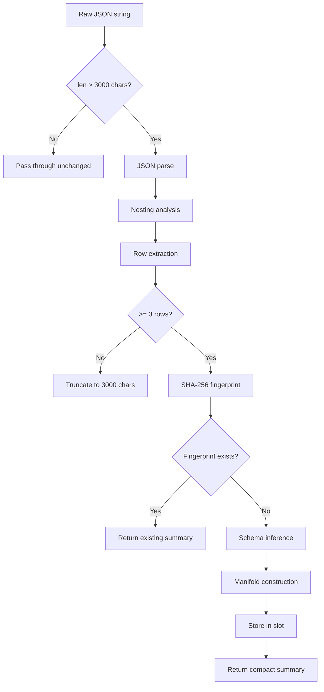
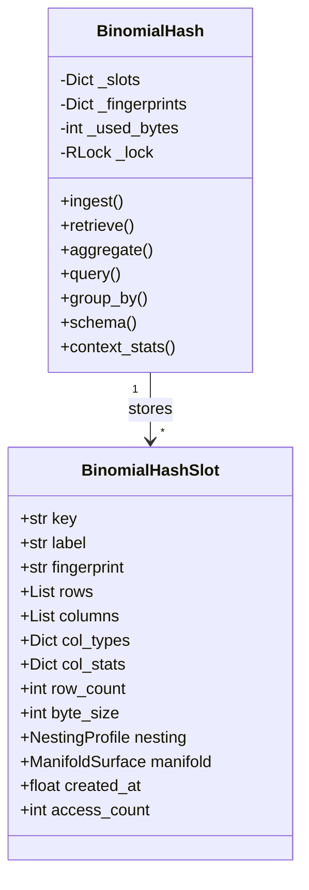
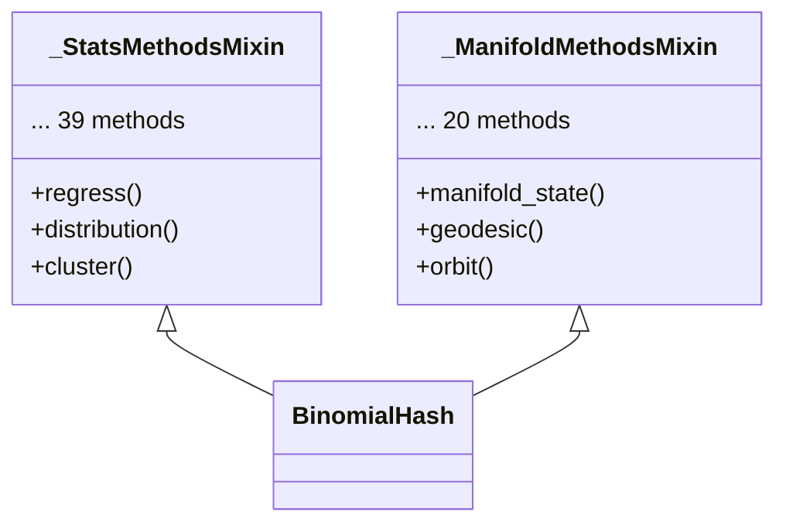

# Architecture

This page describes how BinomialHash processes, stores, and serves structured data internally.

## Overview

BinomialHash is an in-memory, content-addressed data store designed to sit between LLM tool calls and the model's context window. When a tool returns a large JSON payload, BinomialHash compresses it into a compact summary and stores the full data for on-demand retrieval through 68 provider-neutral tools.

## Ingest Pipeline

Every call to `bh.ingest(raw_text, label)` follows this pipeline:



### Step-by-Step

1. **Size check** -- Payloads under 3000 characters pass through unchanged. This threshold is defined by `INGEST_THRESHOLD_CHARS`.

2. **JSON parse** -- The raw string is parsed. Non-JSON text is truncated to 3000 characters with a `[truncated]` marker.

3. **Nesting analysis** -- `analyze_nesting()` walks the parsed JSON to capture structural topology: max depth, branching patterns, array lengths, and a path signature. This metadata is stored alongside the data.

4. **Row extraction** -- `extract_rows()` locates the main list-of-dicts in the JSON structure, regardless of nesting depth. It handles embedded tables (stringified JSON in cells), flattens nested dicts into dot-separated keys, and explodes embedded list-of-dicts columns.

5. **Fingerprinting** -- A SHA-256 hash of the raw input provides content-addressed deduplication. If the same data is ingested again, the existing slot is returned without re-processing.

6. **Schema inference** -- `infer_schema()` classifies each column as numeric, string, date, datetime, bool, dict, list, or mixed. It profiles value distributions, detects semantic subtypes (currency, percent, identifier, free text), and computes statistics (min, max, mean, median, std for numerics; top values and uniqueness for strings).

7. **Manifold construction** -- If the data has at least 10 rows and sufficient axes/fields, `build_manifold()` constructs a discrete manifold surface with adjacency, curvature, Morse classification, and topological invariants.

8. **Slot storage** -- Everything is stored in a `BinomialHashSlot` keyed by `{label_prefix}_{fingerprint[:6]}`.

## Slot Model

Each ingested dataset occupies one slot:



## Budget and Eviction

BinomialHash enforces two limits to prevent unbounded memory growth:

| Limit | Default | Purpose |
|-------|---------|---------|
| `MAX_SLOTS` | 50 | Maximum number of stored datasets |
| `BUDGET_BYTES` | 50 MB | Total memory budget across all slots |

When either limit is reached, the eviction policy removes the least valuable slot first, scoring by `(access_count, created_at)` -- rarely-accessed, oldest slots are evicted first.

## Policy Configuration

`BinomialHashPolicy` is a frozen dataclass that centralises all tunable parameters: preview sizes, export row caps, manifold thresholds, and orbit resolutions. The default policy is used unless overridden:

```python
from binomialhash.core import BinomialHash, BinomialHashPolicy

custom_policy = BinomialHashPolicy(
    export_csv_max_rows=100_000,
    export_markdown_max_rows=500,
)
bh = BinomialHash()
bh._policy = custom_policy
```

## Mixin Architecture

`BinomialHash` inherits from two mixin classes to keep the main class manageable:



- **`_StatsMethodsMixin`** (`_stats_methods.py`) -- 39 statistical analysis methods covering regression, data quality, dependency mapping, driver discovery, structure/topology, causal inference, temporal dynamics, and scale/symmetry laws.
- **`_ManifoldMethodsMixin`** (`_manifold_methods.py`) -- Manifold state inspection, point navigation (geodesic, orbit, basin, ridge/valley trace), frontier detection, coverage audits, wrap audits, and spatial reasoning (heat kernel, Reeb graph, vector field, Laplacian spectrum, scalar harmonics, diffusion distance).

Both mixins use a shared template pattern: look up the slot by key, call the underlying analysis function, track output size, and log timing.

## Thread Safety

All mutable state (`_slots`, `_fingerprints`, `_used_bytes`, context counters) is protected by a `threading.RLock`. The reentrant lock allows internal method calls (e.g., `_get_slot` from `ingest`) to acquire the lock multiple times without deadlocking. See [Async & Threading](async-and-threading.md) for details.
