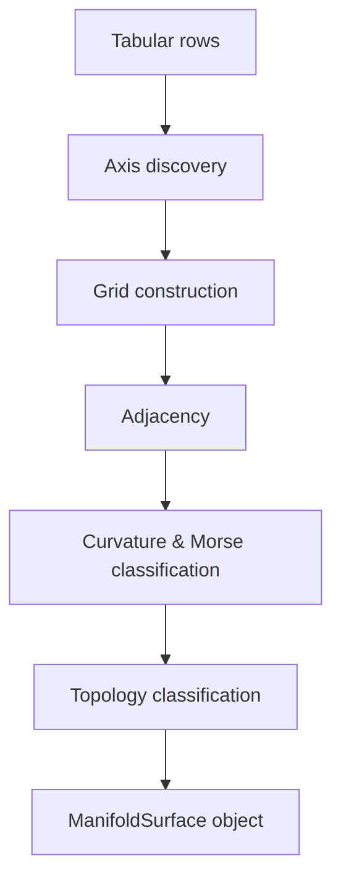

# Manifold Navigation

BinomialHash constructs a discrete manifold surface over ingested tabular data, enabling spatial reasoning, pathfinding, and topological analysis.

## How Manifolds Are Built

During ingest, if the data has at least 10 rows, sufficient axis columns, and numeric field columns, BinomialHash automatically constructs a manifold:



### Axis Discovery

Columns are separated into **axes** (parameter-space dimensions) and **fields** (numeric measurements):

- **Axes** -- categorical, temporal, or low-cardinality numeric columns that define the coordinate system. Capped at 6 axes to prevent combinatorial explosion.
- **Fields** -- numeric columns whose values are averaged at each grid point. Capped at 20.

The algorithm uses normalized entropy, grid coverage, and occupancy heuristics to select the best axis set.

### Grid Construction

Each unique combination of axis values defines a grid point. When multiple rows map to the same coordinate, field values are averaged. Grid points store:

- Axis coordinates (tuple of strings)
- Averaged field values
- Row density (count of contributing rows)
- Curvature, Forman-Ricci curvature, and Morse type (computed after adjacency)

### Adjacency

- **Ordered axes** (numeric, temporal) -- each point connects to its immediate neighbors along the axis. If the axis wraps (detected via boundary similarity), modular arithmetic implements toroidal connections.
- **Categorical axes** -- every value is connected to every other value (fully connected), since there is no natural ordering.

### Boundary Wrap Detection

For each ordered axis, BinomialHash compares mean field values at the low and high boundaries. If similarity exceeds 0.6, the axis is marked as wrapping. Sign analysis determines orientation:

- **Preserving** (+1) -- values match in sign (circle/torus topology)
- **Reversing** (-1) -- values flip in sign (Mobius/Klein topology)

### Surface Classification

The product of per-axis boundary types determines the surface name:

| Axes | Surface |
|------|---------|
| All intervals | `bounded_patch` |
| 1 circle | `cylinder` |
| 2+ circles | `torus` |
| 1 cross-cap + intervals | `mobius_band` |
| Circle + cross-cap | `klein_bottle` |
| 2+ cross-caps | `klein_bottle` |

!!! note
    Surface names are operational diagnostics. Edge-incidence manifoldness is validated; vertex-link validation is on the roadmap.

## Navigation Tools

### Manifold State

```python
result = bh.manifold_state("market_data_abc123")
```

Returns a comprehensive summary: axes, fields, surface name, genus, Euler characteristic, Betti numbers, critical points, persistence pairs, interaction curvature, and curvature peaks.

### Point Navigation

```python
result = bh.manifold_navigate(
    "market_data_abc123",
    coord_json='{"sector": "Technology", "quarter": "Q1"}',
    target_field="revenue",
)
```

Returns the point's field values, curvature, Forman-Ricci, density, neighbor gradients, steepest move direction, Morse type, and basin destination.

### Geodesic Pathfinding

```python
result = bh.geodesic(
    "market_data_abc123",
    start_json='{"sector": "Technology", "quarter": "Q1"}',
    end_json='{"sector": "Financials", "quarter": "Q4"}',
    target_field="revenue",
)
```

Uses Dijkstra with edge weights = |delta target| + epsilon, finding the smoothest path through the target field landscape.

### Orbit and Multiscale View

```python
# Ring of points at distance 2
result = bh.orbit("market_data_abc123", center_json='...', radius=2, target_field="revenue")

# Nested disks at multiple radii
result = bh.multiscale_view("market_data_abc123", center_json='...', radii_json='[1, 2, 3, 5]')
```

### Basin and Trace

```python
# Find the basin of attraction (steepest descent to minimum)
result = bh.basin("market_data_abc123", seed_json='...', target_field="revenue")

# Trace a ridge (steepest ascent)
result = bh.ridge_trace("market_data_abc123", seed_json='...', target_field="revenue")

# Trace a valley (steepest descent)
result = bh.valley_trace("market_data_abc123", seed_json='...', target_field="revenue")
```

### Frontier Detection

Find edges in the manifold that cross between two predicate-defined regions:

```python
result = bh.frontier(
    "market_data_abc123",
    condition_a_json='{"column": "revenue", "op": ">", "value": 1000000}',
    condition_b_json='{"column": "revenue", "op": "<", "value": 500000}',
    target_field="revenue",
)
```

### Controlled Walk

Sweep along a single axis while observing how a target field changes:

```python
result = bh.controlled_walk("market_data_abc123", walk_axis="quarter", target_field="revenue")
```

## Spatial Reasoning Tools

These require numpy and operate on the graph Laplacian of the manifold.

### Heat Kernel Signature

Identifies bottleneck points where heat dissipates slowly:

```python
result = bh.heat_kernel("market_data_abc123", target_field="revenue", n_eigen=20)
```

### Reeb Graph

Tracks how connected components of level sets evolve as the target field sweeps from min to max:

```python
result = bh.reeb_graph("market_data_abc123", target_field="revenue", n_levels=20)
```

### Vector Field Analysis

Computes divergence and curl to identify sources, sinks, vortices, and saddles:

```python
result = bh.vector_field("market_data_abc123", target_field="revenue")
```

### Laplacian Spectrum

Spectral gap analysis for connectivity, Fiedler vector for optimal bisection, and automatic spectral clustering:

```python
result = bh.laplacian_spectrum("market_data_abc123", n_eigen=15)
```

### Scalar Harmonics

Decomposes a field into smooth (low-frequency) and residual (high-frequency) components to find structural anomalies:

```python
result = bh.scalar_harmonics("market_data_abc123", target_field="revenue", n_modes=10)
```

### Diffusion Distance

Measures distance between points by averaging over all paths (robust to noise, unlike geodesic which uses only the shortest path):

```python
result = bh.diffusion_distance("market_data_abc123", time_param=1.0, n_landmarks=8)
```
