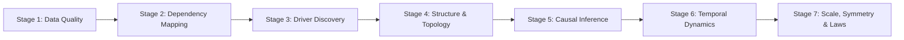

# Statistical Analysis

BinomialHash includes 39 statistical analysis methods organised into 7 progressive stages. Each method operates on stored slot data and returns structured results.

## Overview



All methods are available as both:

- **Direct methods** on `BinomialHash` (e.g., `bh.distribution(key, field)`)
- **LLM tools** via the `stats` tool group (e.g., `bh_distribution`)

## Stage 1: Data Quality

Understand the shape and health of your data before analysis.

| Method | Description |
|--------|-------------|
| `distribution` | Histogram, Jarque-Bera normality test, skewness, kurtosis |
| `outliers` | Z-score and IQR outlier detection across fields |
| `benford` | Benford's Law first-digit analysis for anomaly detection |
| `vif` | Variance Inflation Factor for multicollinearity |
| `effective_dimension` | Intrinsic dimensionality via PCA eigenvalue decay and Levina-Bickel MLE |

```python
# Example: distribution analysis
result = bh.distribution("market_data_abc123", field="price", bins=20)
# Returns: histogram, normality test, skewness, kurtosis, shape classification
```

## Stage 2: Dependency Mapping

Map relationships between variables.

| Method | Description |
|--------|-------------|
| `rank_corr` | Spearman/Kendall rank correlation matrix |
| `chi_squared` | Chi-squared independence test for categorical pairs |
| `anova` | One-way ANOVA between a group column and numeric target |
| `mutual_info_matrix` | Mutual information matrix (nonlinear dependencies) |
| `hsic` | Hilbert-Schmidt Independence Criterion (kernel-based) |
| `copula_tail` | Tail dependency analysis for extreme co-movements |

## Stage 3: Driver Discovery

Identify which variables drive a target outcome.

| Method | Description |
|--------|-------------|
| `polynomial_test` | Test polynomial fits (linear through cubic) |
| `interaction_screen` | Detect synergistic/suppressive variable interactions |
| `sparse_drivers` | LASSO-based feature selection with cross-validation |
| `feature_importance` | Permutation importance scoring |
| `information_bottleneck` | Information-theoretic compression of inputs toward a target |

## Stage 4: Structure & Topology

Discover latent structure in the data.

| Method | Description |
|--------|-------------|
| `cluster` | K-means clustering with automatic k selection via silhouette |
| `spectral_decomposition` | Spectral embedding for nonlinear structure |
| `latent_sources` | Independent Component Analysis (ICA) |
| `graphical_model` | Partial correlation network (graphical lasso or threshold) |
| `persistent_topology` | Persistent homology (Betti numbers, persistence diagrams) |

## Stage 5: Causal Inference

Move from correlation to causation.

| Method | Description |
|--------|-------------|
| `causal_graph` | PC-algorithm skeleton with Meek orientation rules |
| `transfer_entropy` | Directional information flow between time series |
| `do_estimate` | Average Treatment Effect via regression or stratification |
| `counterfactual_impact` | Synthetic control method for counterfactual estimation |

## Stage 6: Temporal Dynamics

Analyse time-ordered data.

| Method | Description |
|--------|-------------|
| `autocorrelation` | ACF with significance bands and stationarity heuristics |
| `changepoints` | Mean-shift change-point detection |
| `rolling_analysis` | Rolling mean, std, and correlation windows |
| `phase_space` | Delay embedding, false nearest neighbors, attractor reconstruction |
| `ergodicity_test` | Time-average vs ensemble-average convergence |
| `recurrence_analysis` | Recurrence plots and quantification |

## Stage 7: Scale, Symmetry & Laws

Probe fundamental properties of the data-generating process.

| Method | Description |
|--------|-------------|
| `entropy_spectrum` | Multi-scale sample entropy for complexity profiling |
| `renormalization_flow` | Coarse-graining flow to detect scale invariance |
| `symmetry_scan` | Translation, scale, and reflection symmetry detection |

## StatsPolicy

All analysis methods respect `StatsPolicy`, a frozen dataclass with ~80 tunable parameters controlling minimum sample sizes, thresholds, iteration limits, and more. The default policy is sensible for most use cases.

## Common Patterns

All 39 methods follow a consistent interface:

```python
result = bh.method_name(key, field_or_params, ...)
```

Every result is a dict containing:

- `"key"` -- the slot key
- Method-specific results
- `"error"` -- present only on failure, with a diagnostic message

Methods that need numpy will return `{"error": "numpy required for ..."}` if numpy is not available (it is a required dependency, so this is defensive only).
